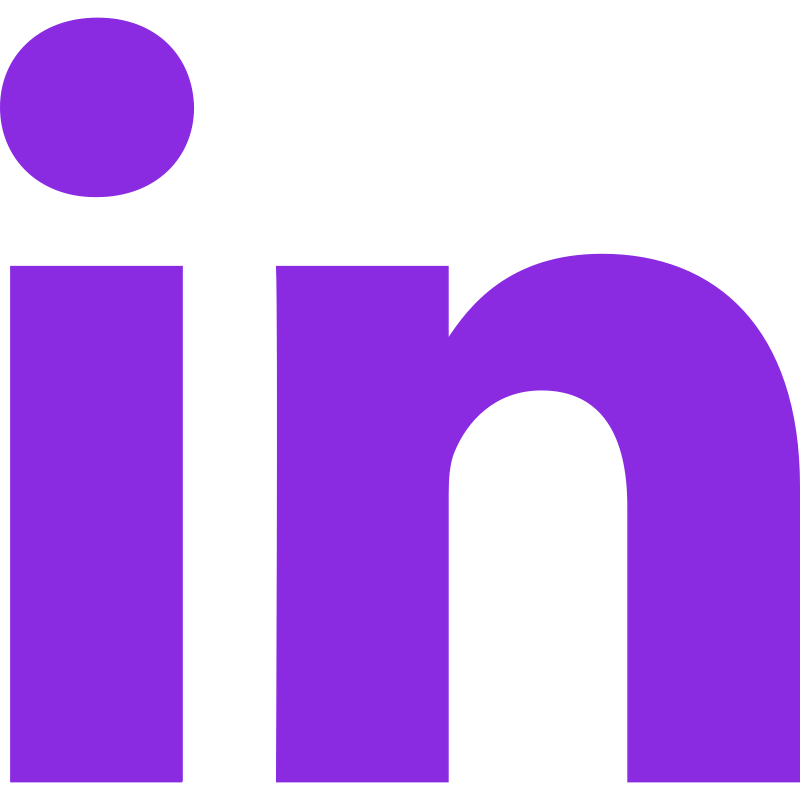

<!-- -->

 

# Hello, I'm Sandra!
 I am a Geodetic Engineering student and a language enthusiast getting into the IT world. My current goal is to become a Frontend Web Developer.

## Programming Languages

 
 
 

## Techs and Tools

 
 
 

## Other Tools

 
 
 

## Languages

🇻🇪 Spanish - Native
 
🇺🇸 English - B2
 
🇷🇺 Russian - A2
 
🇯🇵 Japanese - N5

## Contact

    

<!--
**geasand/geasand** is a ✨ _special_ ✨ repository because its `README.md` (this file) appears on your GitHub profile.

Here are some ideas to get you started:

- 🔭 I’m currently working on ...
- 🌱 I’m currently learning ...
- 👯 I’m looking to collaborate on ...
- 🤔 I’m looking for help with ...
- 💬 Ask me about ...
- 📫 How to reach me: ...
-->
